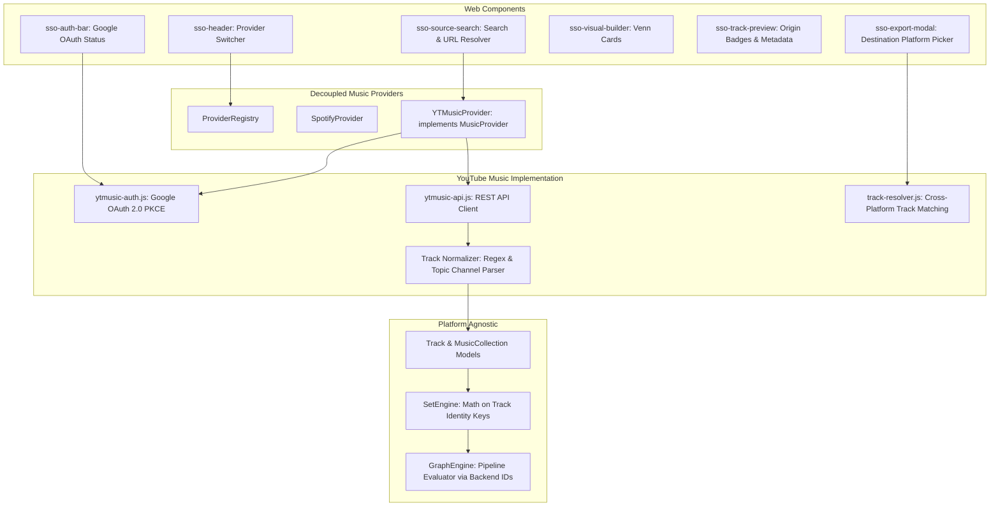

# Architecture & Implementation Plan: YouTube Music Integration

## Executive Summary
This document outlines the end-to-end technical plan to extend **Spotify Set Operations** into a multi-platform set calculator by implementing full support for **YouTube Music** (`ytmusic`).

Once implemented, users will be able to:
1. **Work natively with YouTube Music**: Load playlists and albums, perform set operations (Union $\cup$, Intersection $\cap$, Difference $\setminus$, Symmetric Difference $\Delta$), visualize track counts with interactive Venn diagrams, and export the resulting collections directly back to YouTube Music.
2. **Execute Cross-Platform Set Operations**: Perform hybrid set algebra across platforms (e.g. *Spotify Playlist $\cup$ YouTube Music Playlist*, or *YouTube Music Liked Tracks $\setminus$ Spotify Library*).
3. **Seamless Provider Switching**: Switch between Spotify and YouTube Music in the UI with independent OAuth states, search capabilities, and profile badges while maintaining a clean, serverless Progressive Web App (PWA) architecture.

---

## 1. Technical Feasibility & Architecture Evaluation

YouTube Music does not offer a standalone "YouTube Music Web API" equivalent to the Spotify Web API. Instead, music collections live within the broader YouTube ecosystem. We evaluate two implementation strategies:

### Option A: Official Google YouTube Data API v3 (Recommended Primary Strategy)
* **Protocol**: Official Google REST API (`https://www.googleapis.com/youtube/v3/`) using Google OAuth 2.0 with PKCE / Google Identity Services (GIS).
* **Endpoints**:
  * `playlists.list`: Fetch user's personal playlists.
  * `playlistItems.list`: Paginate through tracks/videos within a playlist (`maxResults=50`).
  * `playlists.insert`: Create new playlists (public, unlisted, or private).
  * `playlistItems.insert`: Add tracks to playlists sequentially or in batches.
  * `playlistItems.delete`: Remove tracks to support playlist replacement.
  * `search.list`: Search for music playlists and videos (`videoCategoryId=10`).
  * `videos.list`: Retrieve rich details (duration from ISO 8601 `PT4M13S`, artist topic attribution).
* **Advantages**:
  * **100% Client-Side Compatible**: Supports standard browser `fetch()` with CORS.
  * **Secure OAuth 2.0 PKCE**: Tokens are held exclusively in browser storage (`localStorage`), requiring zero backend server or credentials proxy.
  * **Interoperable**: Playlists created via YouTube Data API v3 automatically appear and function identically in the YouTube Music web and mobile apps (`music.youtube.com/playlist?list=...`).
* **Constraints & Mitigations**:
  * **Quota Limit (10,000 units/day)**: `search` costs 100 units; `insert` costs 50 units; `list` costs 1 unit.
    * *Mitigation*: Batch video queries (up to 50 IDs per `videos.list` call = 1 unit), aggressive client-side caching of playlist tracks in IndexedDB, and direct URL/ID loading to bypass expensive searches.

### Option B: YouTube Music InnerTube Private API (`youtubei/v1`)
* **Protocol**: The reverse-engineered internal API used by `music.youtube.com`.
* **Advantages**: Rich music metadata (native album release dates, explicit tags, browse IDs `MPREb_...`, official tracks vs fan uploads).
* **Constraints**:
  * Strict browser CORS policies prohibit direct browser calls without a reverse proxy.
  * Authentication requires session cookie extraction or private OAuth tokens, which are brittle in a public client-side PWA.
* **Role in Architecture**: Suitable as an optional companion mode (e.g., Python CLI integration via `ytmusicapi` or local dev proxy), but not as the default client-side PWA engine.

### Decision
We adopt **Option A (Google OAuth 2.0 PKCE + YouTube Data API v3)** as the primary driver for the PWA client, accompanied by an intelligent track normalization engine to bridge YouTube video items into canonical music tracks.

---

## 2. System Architecture & Component Mapping



---

## 3. Data Models & Normalization Strategy

### 3.1 Mapping YouTube Items to Canonical `Track`
YouTube videos are not strictly cataloged as music tracks with ISRCs unless they originate from "Topic" channels (e.g., *Artist - Topic*). The normalization pipeline handles both standard YouTube videos and YouTube Music releases:

```javascript
// Example canonical Track conversion in ytmusic-api.js
const track = new Track({
  id: videoId,                          // e.g. "dQw4w9WgXcQ"
  platform: MusicPlatform.YTMUSIC,      // 'ytmusic'
  name: parsedTitle,                    // e.g. "Never Gonna Give You Up"
  artists: [parsedArtist],              // e.g. "Rick Astley"
  albumName: albumName || 'YouTube Music',
  albumArtUrl: bestThumbnailUrl,        // maxresdefault.jpg or hqdefault.jpg
  durationMs: parseIso8601Duration(iso),// e.g. "PT3M33S" -> 213000 ms
  isrc: extractedIsrc || '',            // Extracted from description if present
  uri: `https://music.youtube.com/watch?v=${videoId}`
});
```

### 3.2 Title & Artist Sanitization Rules
YouTube titles often conflate artist and song name while appending promotional noise:
1. **Title Stripping**: Remove noise terms using regex:
   ```regex
   /\s*(\(|\[)(official (music )?video|official audio|lyric video|remastered \d*|hd|4k|visualizer|live).*?(\)|\])/gi
   ```
2. **Artist Extraction**:
   * If title matches `Artist - Track Name`, split on ` - ` and assign left operand to artist and right operand to track title.
   * If the uploader channel is `* - Topic`, strip ` - Topic` to reliably obtain the primary artist name.
   * Fallback to `snippet.videoOwnerChannelTitle` or `snippet.channelTitle`.
3. **Identity Key Generation**:
   * The existing `Track.identityKey` algorithm automatically handles the cleaned metadata:
     $$\text{identityKey} = \text{meta}:\text{cleanTitle}::\text{cleanArtist}$$
   * Result: A song added from Spotify (`meta:creep::radiohead`) and a video added from YouTube Music (`meta:creep::radiohead`) generate **identical identity keys**, enabling flawless intersection ($\cap$), union ($\cup$), and difference ($\setminus$) operations across platforms.

---

## 4. Provider Implementation Specifications

### 4.1 Authentication Module: `js/providers/ytmusic/ytmusic-auth.js`
* **Flow**: Standard Google OAuth 2.0 PKCE flow (Authorization Code with Proof Key for Code Exchange) or Google Identity Services (GIS) token flow.
* **Endpoints**:
  * Auth: `https://accounts.google.com/o/oauth2/v2/auth`
  * Token: `https://oauth2.googleapis.com/token`
  * User Info: `https://www.googleapis.com/oauth2/v2/userinfo`
* **OAuth Scopes**:
  * `https://www.googleapis.com/auth/youtube`: Full access to view, manage, and edit user playlists and playlist items.
  * `https://www.googleapis.com/auth/userinfo.profile`: User display name and profile picture.
* **Storage Keys**:
  * `sso_ytmusic_client_id`: Configurable Google Cloud OAuth Client ID (default configured in app, overridable in settings).
  * `sso_ytmusic_access_token`: Active Bearer token.
  * `sso_ytmusic_refresh_token`: OAuth refresh token.
  * `sso_ytmusic_expires_at`: Epoch timestamp (ms) of token expiration.
* **Key Methods**:
  * `getClientId()` / `setClientId(id)`
  * `getRedirectUri()` / `setRedirectUri(uri)`
  * `isAuthenticated()`: Validates token validity and handles automatic renewal.
  * `startLogin()`: Generates PKCE code challenge and redirects to Google Auth.
  * `handleCallback(code)`: Exchanges auth code for tokens and persists them.
  * `logout()`: Clears credentials and active session.

### 4.2 API Client: `js/providers/ytmusic/ytmusic-api.js`
* **URL & ID Parser (`parseYouTubeId(input)`)**:
  * Matches and extracts IDs from:
    * `https://music.youtube.com/playlist?list=PL...` (or `OLAK5uy_...`)
    * `https://www.youtube.com/playlist?list=...`
    * `https://music.youtube.com/watch?v=...&list=...`
    * Raw playlist IDs (`PL...`, `OLAK5uy_...`)
    * Album browse IDs (`MPREb_...`)
* **API Methods**:
  * `getCurrentUserProfile()`: Fetches Google profile name and avatar thumbnail.
  * `search(query, types)`:
    * Queries `GET /youtube/v3/search?part=snippet&type=playlist&q={query}&maxResults=20`.
    * Formats results into standard `{ playlists: [...], albums: [...] }` payload.
  * `getPlaylist(playlistId, onProgress)`:
    * Fetches playlist metadata via `GET /youtube/v3/playlists?part=snippet,contentDetails&id={id}`.
    * Paginates through `GET /youtube/v3/playlistItems?part=snippet,contentDetails&playlistId={id}&maxResults=50`.
    * Batches video IDs in groups of 50 to `GET /youtube/v3/videos?part=contentDetails,snippet&id={ids}` to extract exact durations and high-res cover art.
    * Assembles a canonical `MusicCollection` object.
  * `getAlbum(albumId, onProgress)`:
    * YouTube Music albums are exposed as playlists with the `OLAK5uy_` prefix. `getAlbum` normalizes album IDs and delegates to playlist retrieval with `CollectionType.ALBUM`.
  * `createPlaylist({ name, description, isPublic, tracks, onProgress })`:
    * Step 1: `POST /youtube/v3/playlists?part=snippet,status` with title, description, and privacy status (`private` or `public`).
    * Step 2: Iterate through `tracks`, calling `POST /youtube/v3/playlistItems?part=snippet` with `{ playlistId, resourceId: { kind: 'youtube#video', videoId } }`.
    * Step 3: Trigger `onProgress(current, total)` after each addition.
  * `replacePlaylistTracks({ playlistId, tracks, onProgress })`:
    * Step 1: Fetch all current `playlistItem` IDs.
    * Step 2: Delete existing items via `DELETE /youtube/v3/playlistItems?id={itemId}`.
    * Step 3: Insert new track list.

### 4.3 Provider Wrapper: `js/providers/ytmusic/ytmusic-provider.js`
* Replaces the existing stub and binds `ytmusicAuth` and `ytmusicApi` to implement all methods of [`MusicProvider`](file:///home/benw/dev/spotify-set-operations/js/providers/provider-interface.js).
* Registers with [`ProviderRegistry`](file:///home/benw/dev/spotify-set-operations/js/providers/provider-registry.js) on application startup.

---

## 5. Cross-Platform Operations & Track Resolution Engine

When a set operation combines tracks from both Spotify and YouTube Music, exporting to a destination platform requires resolving "foreign" tracks into the destination's native IDs.

```
       [ Spotify Tracks ]               [ YouTube Music Tracks ]
                \                                  /
                 \                                /
                  ▼                              ▼
             [ Set Engine: Math via Canonical Track Identity Keys ]
                                  │
                                  ▼
                 [ Resulting Combined Track Set ]
                                  │
           ┌──────────────────────┴──────────────────────┐
           ▼                                             ▼
[ Export to YouTube Music ]                     [ Export to Spotify ]
  - Native YT tracks kept as-is                   - Native Spotify tracks kept as-is
  - Spotify tracks resolved via                   - YT tracks resolved via
    YouTube search (title + artist)                 Spotify search (title + artist / ISRC)
```

### Track Resolution Module: `js/core/track-resolver.js`
* **Local ID Cache**: Stores verified mappings in `IndexedDB` or `localStorage` under `sso_cross_platform_track_cache` to minimize API queries and quota consumption:
  ```json
  {
    "meta:creep::radiohead": {
      "spotifyId": "70LcF31zb4pqb0NsVaDrFC",
      "ytVideoId": "XFkzRNyygfk",
      "lastVerified": 1727798400000
    }
  }
  ```
* **Resolution Workflow**:
  1. Check local cache for existing cross-platform match.
  2. If missing, query destination platform's search API using `track.name` and `track.artists[0]`.
  3. Validate candidate duration against source track duration ($\pm 15$ seconds tolerance) to avoid live versions or fan covers.
  4. Cache the resolved ID and report progress to the UI.

---

## 6. UI & Web Component Enhancements

| Component | Necessary Modifications |
| :--- | :--- |
| `<sso-header>` | 1. Remove "(Coming Soon)" label from YouTube Music in the provider dropdown.<br>2. Add YouTube Music brand red styling when active.<br>3. Display YouTube user display name and profile thumbnail. |
| `<sso-auth-bar>` | 1. Reactively display Google OAuth connection status when YouTube Music is selected.<br>2. Provide one-click "Connect YouTube Music" button.<br>3. Show active Google email/channel info. |
| `<sso-source-search>` | 1. Support pasting YouTube Music URLs (`music.youtube.com/playlist?list=...`) directly.<br>2. Execute search against `ytmusicApi.search` when active.<br>3. Render YouTube Music source badges on result cards. |
| `<sso-track-preview>` | 1. Display platform badges (Spotify green badge vs. YouTube Music red badge) on each row.<br>2. Direct link to `music.youtube.com/watch?v=...` for YouTube tracks. |
| `<sso-export-modal>` | 1. Allow user to select export destination: **YouTube Music** or **Spotify**.<br>2. Show two-stage progress bar: (Stage 1: Resolving cross-platform songs, Stage 2: Inserting tracks to playlist). |
| Settings Modal | Add tabbed configuration: Spotify Client ID / Callback URI and Google OAuth Client ID / Callback URI. |

---

## 7. Quota & Rate-Limit Strategy for YouTube Data API v3

The Google YouTube Data API v3 defaults to **10,000 quota units per day** per project. The implementation must be designed to avoid quota starvation:

1. **Batching Video Queries**:
   * Never query videos individually. Always batch up to 50 video IDs per `videos.list` request (50 tracks cost 1 unit total instead of 50 units).
2. **Aggressive Playlist Caching**:
   * Store fetched playlist tracklists in `sessionStorage` or `IndexedDB` with an ETag or TTL. If a user revisits or operates on the same playlist multiple times in a session, zero additional quota units are consumed.
3. **Throttled Sequential Inserts**:
   * `playlistItems.insert` (50 units each): Introduce a 100ms pause between inserts to avoid hitting per-minute write limits.
   * If an HTTP 429 or 403 `quotaExceeded` error is returned, surface an informative alert modal detailing when the quota resets (midnight PST) and allow the user to provide their own personal Google Cloud Client ID.

---

## 8. Phased Implementation Roadmap

### Phase 1: Authentication & Settings Setup
* [x] Create `js/providers/ytmusic/ytmusic-auth.js` implementing PKCE OAuth for Google.
* [x] Create callback handler in `callback.html` and `callback/index.html` supporting both Spotify and Google OAuth state parameters.
* [x] Update Settings dialog to allow configuring Google Client ID and Redirect URI with dual-provider tabs.
* [x] Add automated unit tests for `ytmusic-auth.js` credential handling, PKCE URL generation, and profile parsing.

### Phase 2: Core YouTube API & Normalization Engine
* [x] Create `js/providers/ytmusic/ytmusic-api.js`:
  * [x] Implement URL and ID parser (`parseYouTubeId`).
  * [x] Implement `getCurrentUserProfile()`.
  * [x] Implement `getPlaylist()` with 50-track batching and ISO 8601 duration parser.
  * [x] Implement `getAlbum()` delegating to playlist retrieval with `CollectionType.ALBUM`.
  * [x] Implement title & artist regex normalization for standard YouTube videos and topic channels.
  * [x] Implement `search(query, types)` using YouTube Data API v3.
* [x] Update `js/providers/ytmusic/ytmusic-provider.js` to wire read operations to `ytmusicApi`.
* [x] Update `sso-source-search.js` to support YouTube Music search and direct URL/ID loading.
* [x] Add automated unit tests verifying parsing of diverse YouTube Music / YouTube URLs, durations, and title sanitization.

### Phase 3: Export & Playlist Creation
* [x] Implement `createPlaylist()` and `replacePlaylistTracks()` in `ytmusic-api.js`.
* [x] Add batching, progress callbacks, and error recovery for long playlists.
* [x] Integrate with `<sso-export-modal>`.

### Phase 4: Cross-Platform Track Resolution
* [x] Create `js/core/track-resolver.js`.
* [x] Implement bidirectional matching (Spotify $\leftrightarrow$ YouTube Music) with local caching.
* [x] Update `<sso-export-modal>` with resolution progress indicators.
* [x] Add automated tests for cross-platform set operations (`Spotify Track ∩ YouTube Track`).

### Phase 5: Service Worker, Polish & Verification
* [x] Register new files in `sw.js` `STATIC_ASSETS` and increment cache version.
* [x] Update `README.md` documentation with YouTube Music setup instructions.
* [x] Run complete test suite (`npm test`) and perform end-to-end visual testing in the browser.
